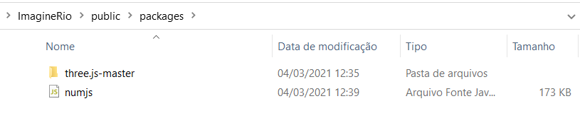

# Extrator de Texturas

Repositório criado para armazenar o código realizado ao projeto Vistas Situadas do Rio de Janeiro (uma colaboração entre a Universidade de Rice, responsável imagineRio, e o Instituto Moreira Salles) pela FGVRJ.

## Instalando os requerimentos (Windows)

Para o arquivo .html rodar corretamente são necessárias duas coisas: instalar o Node e o pacote threejs utilizado no Javascript. Com isso, seguem abaixo os links onde você pode baixá-los.

### Node

O Node possui diversas versões. Uma boa prática para manter diversas versões do Node no computador chama-se Node Version Manager (NVM). Contanto, a instalação do NVM é opcional e você pode apenas instalar o Node.

- Para adquirir o NVM: https://github.com/coreybutler/nvm-windows/releases/tag/1.1.7;
- Para instalar o Node: https://nodejs.org/en/;

### Pacotes JavaScript

Os pacotes utilizados no projeto foram escolhidos de maneira a facilitar o trabalho. Seguem abaixo as descrições:

- O threejs pode ser adquirido pela pasta descompactada do zip que se encontra em https://threejs.org/;

Com isso, a pasta baixada deve se encontrar dentro do diretório "public/packages", como será mostrado na próxima seção.

### Verificando a instalação

Após os passos acima serem seguidos, você deve possuir a pasta packages semelhante a isso:

Com isso, basta agora executar o Node.

### Executando o Node

Após toda a instalação estar correta, basta executar a seguinte linha de código no prompt do Windows (Windows+R digitando cmd)

    node nodeServer.js

caso você se encontre na pasta do projeto. Caso não, você pode navegar até ela usando

    cd "C:\DiretorioDaPasta"

pelo sistema de arquivos do Windows. Com isso, deve-se aparecer uma mensagem no prompt escrita "listening at http://localhost:8000". Este é o link do servidor local onde o projeto está hospedado. Caso você atualize algum arquivo, para reiniciar o servidor basta cancelar o atual usando CTRL+C e executar o Node novamente.

## Como funciona?

Essa seção se dedica à explicar os funcionamentos desenvolvidos até agora.

### Calibração

Após carregar uma imagem Web ou local (nome completo e salva na pasta images), deve-se calibrar os parâmetros da câmera escolhendo para cada eixo dois pares de segmentos de reta apropriados. Depois disso, clicar em calcular.

Você também pode salvar essa calibração juntamente com a imagem para carregá-las depois, através de salvar calibração e carregar calibração (ficarão salvas na pasta calib).

Atualmente se encontram duas calibrações como exemplo, "cabex1" e "cabex2".

### Extração

Trabalho em andamento, atualmente se pode extrair as texturas da seguinte maneira: primeiro se escolhe o plano paralelo e clica-se no botão extrair. Depois disso, selecione três pontos no canvas da imagem: dois no mesmo eixo e um para "extensão". Com isso, este será criado no ambiente 3D. Para alternar entre o ambiente 3D e 2D basta pressionar a tecla T. O controle da câmera se é realizado através das teclas WASD para movimento de sua posição e SETAS para controle de ângulo.

Assim, para criar outros planos você deve selecionar novamente o novo plano paralelo e clicar no segmento de reta de onde deseja extender, e depois o ponto de extensão. Este também será adicionado à cena 3D.
